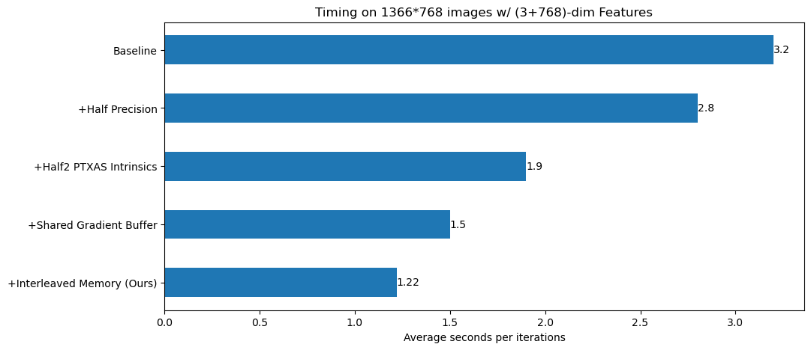
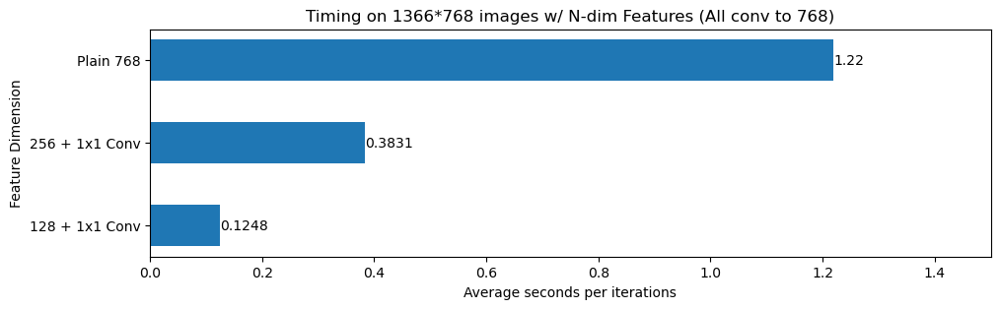

# Gaussian Feature

This repo implements feature splattiing, which combines gaussian splatting with feature distillation. Compared to simple
extension to the original gaussian splatting, our implementation is much faster and more memory-efficient.

For plain 768-dim feature rendering, our method achieves ~60% speedup with negligible accuracy loss (FP32->FP16).

<a href="assets/CUDA_timing.png"> </a>

For further speedup, we render implicit 64-dim features and then convolve them to 768-dim features. This achieves additional
~10 speedup.

<a href="assets/feat_timing.png"> </a>

## Setup dependency

Clone the codebase.

```
git clone --recursive https://github.com/RogerQi/gaussian_feature
```

Follow [INSTALL.md](INSTALL.md) to install required dependencies.

## Prepare data

This repo is built for feature splatting. At the moment, it only supports training with both
RGB and features. We provide a [sample dataset](https://drive.google.com/file/d/1PIzEsacgJJlI-X-Z6Hjti3_-qdF3n_2W/view?usp=sharing)
for training, which is a single room scene
from the original gaussian splatting dataset with features generated by [Patched CLIP](https://github.com/RogerQi/Patched_CLIP).

## Feature distillation

The rasterization process of Gaussian is a memory-consuming process. Although we could directly rasterize
high-dimensional features (e.g., 768-dim), the memory quickly runs out as the number of gaussians increases
(e.g., for the provided datasets, the number of Gaussians grows from ~80K to 50M). To address this issue,
we instead use implicit lower-dimensional features (e.g., 64-dim) in every Gaussian. After rasterization is done,
the features are then convolved to the original dimension (e.g., 768-dim) by 1x1 convolutions, which can later be used
as per-point MLP.

To train the implicit features, we use the following command:

```bash
python train.py -s feat_data/drjohnson --low_dim_feat
```

After the training is done, you can run the default RGB viewer of the original Gaussian splatting to visualize the
RGB features. Alternatively, you can also examine the learned features by looking at `output/HEX_ID/point_cloud/iteration_10000/point_cloud_distill_feat.pth`.
